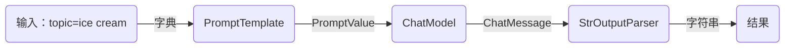

LangChain 表达式语言，或者 LCEL，是一种声明式的方式，可以轻松地将链条组合在一起。 LCEL 从第一天开始就被设计为**支持将原型放入生产中，不需要改变任何代码**，从最简单的“提示+LLM”链到最复杂的链(我们已经看到人们成功地在生产中运行了包含数百步的 LCEL 链)。以下是你可能想要使用 LCEL 的一些原因：

**流式支持** 当你用 LCEL 构建你的链时，你可以得到最佳的首次到令牌的时间(输出的第一块内容出来之前的时间)。对于一些链，这意味着例如我们直接从 LLM 流式传输令牌到一个流式输出解析器，你可以以与 LLM 提供者输出原始令牌相同的速率得到解析后的、增量的输出块。

**异步支持** 任何用 LCEL 构建的链都可以通过同步 API(例如在你的 Jupyter 笔记本中进行原型设计时)以及异步 API(例如在 LangServe 服务器中)进行调用。这使得可以使用相同的代码进行原型设计和生产，具有很好的性能，并且能够在同一台服务器中处理许多并发请求。

**优化的并行执行** 无论何时，你的 LCEL 链有可以并行执行的步骤(例如，如果你从多个检索器中获取文档)，我们都会自动执行，无论是在同步接口还是异步接口中，以获得最小可能的延迟。

**重试和回退** 为你的 LCEL 链的任何部分配置重试和回退。这是一种使你的链在大规模下更可靠的好方法。我们目前正在努力为重试/回退添加流式支持，这样你就可以在没有任何延迟成本的情况下获得增加的可靠性。

**访问中间结果** 对于更复杂的链，通常在最终输出产生之前就能访问中间步骤的结果是非常有用的。这可以用来让最终用户知道正在发生什么，甚至只是用来调试你的链。你可以流式传输中间结果，它在每个 LangServe 服务器上都可用。

**输入和输出模式** 输入和输出模式为每个 LCEL 链提供了从你的链的结构中推断出来的 Pydantic 和 JSONSchema 模式。这可以用于验证输入和输出，是 LangServe 的一个重要部分。

**无缝的 LangSmith 跟踪集成** 随着你的链变得越来越复杂，理解在每一步究竟发生了什么变得越来越重要。 使用 LCEL，**所有**步骤都会自动记录到 LangSmith，以实现最大的可观察性和可调试性。

**无缝的 LangServe 部署集成** 任何用 LCEL 创建的链都可以使用 LangServe 轻松部署。

## 1、开始使用

LCEL 使得从基本组件构建复杂链条变得容易，并且支持诸如流式处理、并行处理和日志记录等开箱即用的功能。

**基本示例：提示 + 模型 + 输出解析器**

最基本和常见的用例是将提示模板和模型链接在一起。为了了解这是如何工作的，让我们创建一个链条，它接受一个主题并生成一个笑话：

[start](codes/3.LCEL/1.basic.py ":include :type=code :fragment=start")

请注意这行代码，我们使用 LCEL 将不同的组件组合成一个单一的链条：

```text
chain = prompt | model | output_parser
```

`|` 符号类似于 [unix 管道操作符](<https://en.wikipedia.org/wiki/Pipeline_(Unix)>)，它将不同的组件链接在一起，将一个组件的输出作为下一个组件的输入。

在这个链条中，用户输入被传递给提示模板，然后提示模板的输出被传递给模型，然后模型的输出被传递给输出解析器。让我们逐个组件地看一下，以真正理解发生了什么。

### （1）提示

`prompt` 是一个 `BasePromptTemplate`，这意味着它接受一个模板变量的字典并生成一个 `PromptValue`。`PromptValue` 是一个包装完成的提示的包装器，可以传递给 `LLM`（它以字符串作为输入）或 `ChatModel`（它以消息序列作为输入）。它可以与任何语言模型类型一起使用，因为它定义了生成 `BaseMessage` 和生成字符串的逻辑。

[prompt](codes/3.LCEL/1.basic.py ":include :type=code :fragment=prompt")

### （2）模型

然后将 `PromptValue` 传递给 `model`。这意味着它将输出一个 `BaseMessage`。

[model](codes/3.LCEL/1.basic.py ":include :type=code :fragment=model")

### （3）输出解析器

最后，我们将 `model` 的输出传递给 `output_parser`，它是一个 `BaseOutputParser`，意味着它可以接受字符串或 `BaseMessage` 作为输入。`StrOutputParser` 简单地将任何输入转换为字符串。

[output](codes/3.LCEL/1.basic.py ":include :type=code :fragment=out")

### （4）整个流程

按照以下步骤进行操作：

1. 我们将用户输入的主题作为 `{"topic": "ice cream"}` 传入。
2. `prompt` 组件接受用户输入，然后使用主题构建提示，生成 `PromptValue`。
3. `model` 组件接受生成的提示，并将其传递给 OpenAI LLM 模型进行评估。模型生成的输出是一个 `ChatMessage` 对象。
4. 最后，`output_parser` 组件接受一个 `ChatMessage`，将其转换为 Python 字符串，并从 `invoke` 方法返回。



请注意，如果您对任何组件的输出感到好奇，您可以始终测试链条的较小版本，例如 `prompt` 或 `prompt | model`，以查看中间结果：

```python
input = {"topic": "ice cream"}

prompt.invoke(input)
# messages=[HumanMessage(content='tell me a short joke about ice cream')]

(prompt | model).invoke(input)
# content='Why did the ice cream truck break down?\nIt had too many sundaes on the menu!' response_metadata={'token_usage': {'completion_tokens': 20, 'prompt_tokens': 15, 'total_tokens': 35}, 'model_name': 'gpt-3.5-turbo', 'system_fingerprint': 'fp_3bc1b5746c', 'finish_reason': 'stop', 'logprobs': None}
```

## 2、RAG (retrieval-augmented generation)搜索示例

对于下一个示例，我们想要运行一个检索增强生成链条，在回答问题时添加一些上下文。

安装环境

```bash
pip install langchain docarray tiktoken
```

[rag](codes/3.LCEL/2.rag.py ":include :type=code ")

在这种情况下，组合的链条是：

```python
chain = setup_and_retrieval | prompt | model | output_parser
```

首先，让我们看到上面的提示模板接受 `context` 和 `question` 作为要替换在提示中的值。在构建提示模板之前，我们希望检索相关文档并将其作为上下文的一部分包含在内。

作为预备步骤，我们使用内存存储设置了检索器，它可以根据查询检索文档。这也是一个可链接的可运行组件，但您也可以尝试单独运行它：

```python
retriever.invoke("where did harrison work?")
```

然后，我们使用 `RunnableParallel` 来通过使用检索器进行文档搜索和使用 `RunnablePassthrough` 来传递用户的问题，准备好传递给提示的预期输入：

```python
setup_and_retrieval = RunnableParallel(
    {"context": retriever, "question": RunnablePassthrough()}
)
```

回顾一下，完整的链条是：

```python
chain = setup_and_retrieval | prompt | model | output_parser
```

流程如下：

1. 首先，创建一个 `RunnableParallel` 对象，其中包含两个条目。第一个条目 `context` 将包含检索器检索到的文档结果。第二个条目 `question` 将包含用户的原始问题。为了传递问题，我们使用 `RunnablePassthrough` 来复制该条目。
2. 将上述步骤中的字典提供给 `prompt` 组件。然后，它将用户输入（即 `question`）以及检索到的文档（即 `context`）用于构建提示，并输出 `PromptValue`。
3. `model` 组件接受生成的提示，并将其传递给 OpenAI LLM 模型进行评估。模型生成的输出是一个 `ChatMessage` 对象。
4. 最后，`output_parser` 组件接受一个 `ChatMessage`，将其转换为 Python 字符串，并从 `invoke` 方法返回。

````mermaid
graph LR
    A(问题) --> B(RunnableParallel)
    B -->|问题| C(检索器)
    B -->|问题| D(RunnablePassThrough)
    C -->|context=检索到的文档| E(PromptTemplate)
    D -->|question=问题| E
    E -->|PromptValue| F(ChatModel)
    F -->|ChatMessage| G(StrOutputParser)
    G --> |字符串| H(结果)
